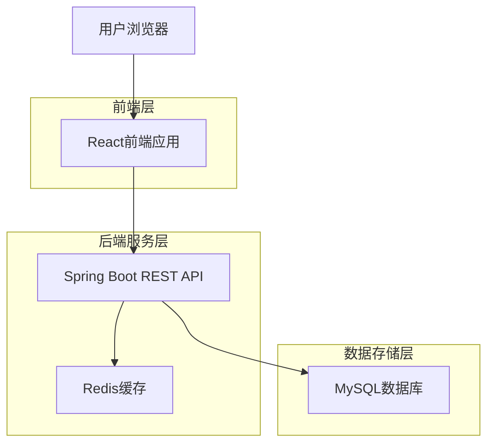
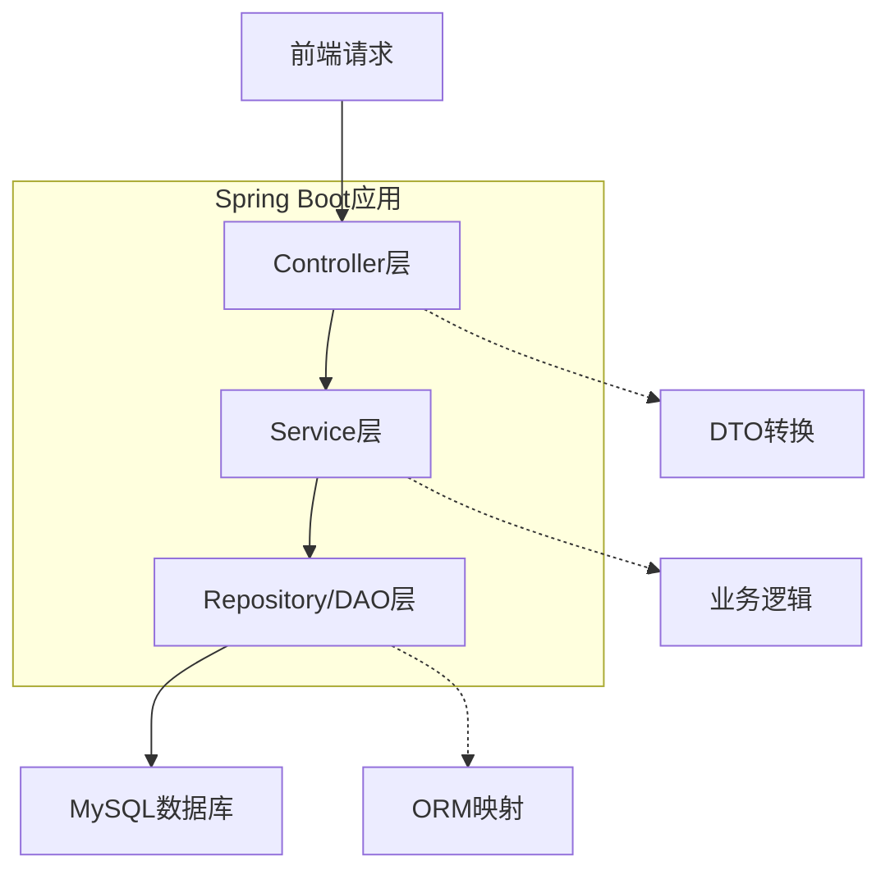
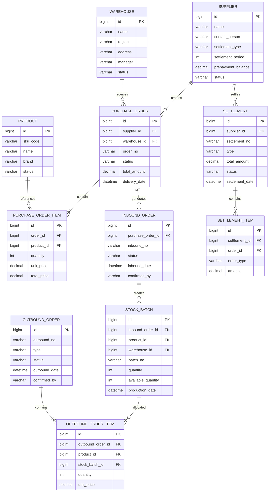
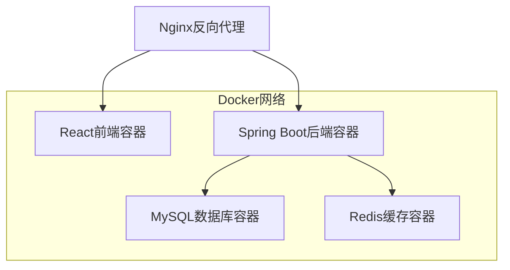

# 供应链管理系统技术架构文档

## 1. 架构设计

### 1.1 整体架构图



### 1.2 后端架构分层



## 2. 技术栈描述

### 2.1 后端技术栈
- **开发语言**: Java 11+
- **框架**: Spring Boot 2.7+
- **数据库**: MySQL 8.0
- **ORM框架**: MyBatis 3.5+
- **缓存**: Redis 6.0+
- **安全框架**: Spring Security + JWT
- **API文档**: Swagger/OpenAPI 3.0
- **文件存储**: 本地文件系统 (已设计接口支持 AWS S3/OSS 扩展)
- **构建工具**: Maven 3.8+

### 2.2 前端技术栈
- **框架**: React 18
- **UI组件库**: Ant Design 5.12+
- **状态管理**: React Context + useReducer
- **路由**: React Router v6
- **构建工具**: Vite 5.0+
- **语言**: TypeScript 5.0+

### 2.3 开发工具
- **IDE**: IntelliJ IDEA / VS Code
- **数据库工具**: MySQL Workbench
- **API测试**: Postman
- **版本控制**: Git

## 3. 路由定义

### 3.1 前端路由
| 路由路径 | 页面功能 |
|---------|---------|
| /supply-chain/brand | 品牌管理列表 |
| /supply-chain/supplier | 供应商管理 |
| /supply-chain/product-pool | 商品池管理 |
| /supply-chain/bundle | 组合商品管理 |
| /supply-chain/price-adjustment | 调价单管理 |
| /supply-chain/purchase-order | 采购单管理 |
| /supply-chain/platform-confirm | 平台确认单 |
| /supply-chain/warehouse | 仓库管理 |
| /supply-chain/warehouse-product | 分仓商品列表 |
| /supply-chain/inbound | 入库单管理 |
| /supply-chain/outbound | 出库单管理 |
| /supply-chain/stock-flow | 出入库流水 |
| /supply-chain/logistics-provider | 物流商管理 |
| /supply-chain/settlement/pending | 待结算管理 |
| /supply-chain/settlement/delivery | 待发货结算 |
| /supply-chain/settlement/supplier | 供应商结算单列表 |
| /supply-chain/inventory-report | 库存报表 |

### 3.2 后端API路由
| API路径 | 功能描述 |
|---------|---------|
| /api/auth/* | 认证授权相关 |
| /api/brands/* | 品牌管理 |
| /api/suppliers/* | 供应商管理 |
| /api/products/* | 商品池管理 |
| /api/purchase-orders/* | 采购单管理 |
| /api/warehouses/* | 仓库管理 |
| /api/inbound-orders/* | 入库单管理 |
| /api/outbound-orders/* | 出库单管理 |
| /api/settlements/* | 结算管理 |
| /api/inventory/* | 库存管理 |

## 4. API设计规范

### 4.1 统一响应格式
```typescript
interface ApiResponse<T> {
  code: number;
  message: string;
  data: T;
  timestamp: string;
  requestId: string;
}
```

### 4.2 分页响应格式
```typescript
interface PageResponse<T> {
  code: number;
  message: string;
  data: {
    records: T[];
    total: number;
    pageNum: number;
    pageSize: number;
    pages: number;
  };
  timestamp: string;
}
```

### 4.3 核心API定义

#### 4.3.1 用户认证
```
POST /api/auth/login
```

请求参数：
| 参数名 | 类型 | 必需 | 描述 |
|--------|------|------|------|
| username | string | 是 | 用户名 |
| password | string | 是 | 密码 |

响应示例：
```json
{
  "code": 200,
  "message": "登录成功",
  "data": {
    "token": "eyJhbGciOiJIUzI1NiIsInR5cCI6IkpXVCJ9...",
    "userInfo": {
      "id": 1,
      "username": "admin",
      "role": "ADMIN"
    }
  },
  "timestamp": "2026-01-21T10:00:00Z"
}
```

#### 4.3.2 采购单创建
```
POST /api/purchase-orders
```

请求参数：
| 参数名 | 类型 | 必需 | 描述 |
|--------|------|------|------|
| supplierId | number | 是 | 供应商ID |
| items | array | 是 | 采购商品列表 |
| deliveryDate | string | 是 | 预计交付日期 |
| warehouseId | number | 是 | 目标仓库ID |

## 5. 数据库设计

### 5.1 实体关系图



### 5.2 核心表结构

#### 5.2.1 供应商表 (suppliers)
```sql
CREATE TABLE suppliers (
    id BIGINT PRIMARY KEY AUTO_INCREMENT,
    supplier_no VARCHAR(50) UNIQUE NOT NULL COMMENT '供应商编号',
    name VARCHAR(200) NOT NULL COMMENT '供应商名称',
    contact_person VARCHAR(100) COMMENT '联系人',
    contact_phone VARCHAR(50) COMMENT '联系电话',
    settlement_type ENUM('PREPAYMENT', 'CASH', 'PERIOD') NOT NULL COMMENT '结算类型：预付/现付/周期',
    settlement_period INT COMMENT '结算周期(天)',
    prepayment_balance DECIMAL(15,2) DEFAULT 0 COMMENT '预付款余额',
    status ENUM('ACTIVE', 'INACTIVE') DEFAULT 'ACTIVE' COMMENT '状态',
    created_at TIMESTAMP DEFAULT CURRENT_TIMESTAMP,
    updated_at TIMESTAMP DEFAULT CURRENT_TIMESTAMP ON UPDATE CURRENT_TIMESTAMP,
    INDEX idx_supplier_no (supplier_no),
    INDEX idx_status (status)
) ENGINE=InnoDB DEFAULT CHARSET=utf8mb4 COMMENT='供应商信息表';
```

#### 5.2.2 采购订单表 (purchase_orders)
```sql
CREATE TABLE purchase_orders (
    id BIGINT PRIMARY KEY AUTO_INCREMENT,
    order_no VARCHAR(50) UNIQUE NOT NULL COMMENT '采购订单编号',
    supplier_id BIGINT NOT NULL COMMENT '供应商ID',
    warehouse_id BIGINT NOT NULL COMMENT '目标仓库ID',
    type ENUM('INBOUND', 'DROPSHIP', 'SELF') NOT NULL COMMENT '采购类型：入库/代发/自配',
    status ENUM('PENDING', 'CONFIRMED', 'SHIPPED', 'RECEIVED', 'COMPLETED', 'CANCELLED') DEFAULT 'PENDING' COMMENT '订单状态',
    total_amount DECIMAL(15,2) NOT NULL COMMENT '订单总金额',
    delivery_date DATE COMMENT '预计交付日期',
    remark TEXT COMMENT '备注',
    created_by VARCHAR(50) NOT NULL COMMENT '创建人',
    created_at TIMESTAMP DEFAULT CURRENT_TIMESTAMP,
    updated_at TIMESTAMP DEFAULT CURRENT_TIMESTAMP ON UPDATE CURRENT_TIMESTAMP,
    FOREIGN KEY (supplier_id) REFERENCES suppliers(id),
    INDEX idx_order_no (order_no),
    INDEX idx_supplier_id (supplier_id),
    INDEX idx_status (status),
    INDEX idx_created_at (created_at)
) ENGINE=InnoDB DEFAULT CHARSET=utf8mb4 COMMENT='采购订单表';
```

#### 5.2.3 库存批次表 (stock_batches)
```sql
CREATE TABLE stock_batches (
    id BIGINT PRIMARY KEY AUTO_INCREMENT,
    batch_no VARCHAR(50) UNIQUE NOT NULL COMMENT '批次编号',
    product_id BIGINT NOT NULL COMMENT '商品ID',
    warehouse_id BIGINT NOT NULL COMMENT '仓库ID',
    inbound_order_id BIGINT COMMENT '入库单ID',
    quantity INT NOT NULL COMMENT '总数量',
    available_quantity INT NOT NULL COMMENT '可用数量',
    locked_quantity INT DEFAULT 0 COMMENT '锁定数量',
    unit_cost DECIMAL(10,2) NOT NULL COMMENT '单位成本',
    total_cost DECIMAL(15,2) NOT NULL COMMENT '总成本',
    production_date DATE COMMENT '生产日期',
    expiry_date DATE COMMENT '过期日期',
    status ENUM('ACTIVE', 'EXPIRED', 'SOLD_OUT') DEFAULT 'ACTIVE' COMMENT '状态',
    created_at TIMESTAMP DEFAULT CURRENT_TIMESTAMP,
    updated_at TIMESTAMP DEFAULT CURRENT_TIMESTAMP ON UPDATE CURRENT_TIMESTAMP,
    FOREIGN KEY (product_id) REFERENCES products(id),
    FOREIGN KEY (warehouse_id) REFERENCES warehouses(id),
    INDEX idx_batch_no (batch_no),
    INDEX idx_product_warehouse (product_id, warehouse_id),
    INDEX idx_status (status)
) ENGINE=InnoDB DEFAULT CHARSET=utf8mb4 COMMENT='库存批次表';
```

## 6. 项目目录结构

```
d:\AIPRO\supplypro\
├── backend/                          # Spring Boot后端项目
│   ├── src/main/java/com/supplypro/
│   │   ├── controller/               # 控制器层
│   │   │   ├── AuthController.java
│   │   │   ├── SupplierController.java
│   │   │   ├── PurchaseOrderController.java
│   │   │   ├── WarehouseController.java
│   │   │   ├── InventoryController.java
│   │   │   └── SettlementController.java
│   │   ├── service/                  # 服务层
│   │   │   ├── AuthService.java
│   │   │   ├── SupplierService.java
│   │   │   ├── PurchaseOrderService.java
│   │   │   ├── InventoryService.java
│   │   │   └── SettlementService.java
│   │   ├── repository/               # 数据访问层
│   │   │   ├── SupplierRepository.java
│   │   │   ├── PurchaseOrderRepository.java
│   │   │   ├── StockBatchRepository.java
│   │   │   └── SettlementRepository.java
│   │   ├── entity/                   # 实体类
│   │   │   ├── Supplier.java
│   │   │   ├── PurchaseOrder.java
│   │   │   ├── StockBatch.java
│   │   │   └── Settlement.java
│   │   ├── dto/                      # 数据传输对象
│   │   │   ├── SupplierDTO.java
│   │   │   ├── PurchaseOrderDTO.java
│   │   │   └── SettlementDTO.java
│   │   ├── config/                   # 配置类
│   │   │   ├── SecurityConfig.java
│   │   │   ├── MyBatisConfig.java
│   │   │   └── RedisConfig.java
│   │   └── SupplyProApplication.java
│   ├── src/main/resources/
│   │   ├── application.yml          # 应用配置
│   │   ├── application-dev.yml      # 开发环境配置
│   │   ├── application-prod.yml     # 生产环境配置
│   │   ├── mapper/                  # MyBatis映射文件
│   │   │   ├── SupplierMapper.xml
│   │   │   ├── PurchaseOrderMapper.xml
│   │   │   └── InventoryMapper.xml
│   │   └── db/migration/            # 数据库迁移脚本
│   │       ├── V1.0__init_schema.sql
│   │       └── V1.1__init_data.sql
│   ├── pom.xml                       # Maven依赖配置
│   └── Dockerfile                    # Docker镜像构建文件
│
├── frontend/                         # React前端项目
│   ├── src/
│   │   ├── components/              # 公共组件
│   │   │   ├── Header/
│   │   │   ├── Sidebar/
│   │   │   └── CommonTable/
│   │   ├── pages/                   # 页面组件
│   │   │   ├── Brand/
│   │   │   ├── Supplier/
│   │   │   ├── PurchaseOrder/
│   │   │   ├── Warehouse/
│   │   │   ├── Settlement/
│   │   │   └── Dashboard/
│   │   ├── services/                # API服务
│   │   │   ├── api.ts
│   │   │   ├── authService.ts
│   │   │   ├── supplierService.ts
│   │   │   └── purchaseService.ts
│   │   ├── types/                   # TypeScript类型定义
│   │   │   ├── supplier.ts
│   │   │   ├── purchase.ts
│   │   │   └── common.ts
│   │   ├── utils/                   # 工具函数
│   │   │   ├── request.ts
│   │   │   ├── format.ts
│   │   │   └── export.ts
│   │   ├── App.tsx
│   │   └── main.tsx
│   ├── public/
│   ├── package.json
│   ├── tsconfig.json
│   ├── vite.config.ts
│   └── Dockerfile
│
├── docs/                            # 项目文档
│   ├── Technical_Architecture.md   # 技术架构文档
│   ├── API_Documentation.md        # API接口文档
│   ├── Database_Design.md           # 数据库设计文档
│   └── Deployment_Guide.md          # 部署指南
│
├── docker-compose.yml              # Docker编排文件
├── .env.example                     # 环境变量示例
└── README.md                        # 项目说明文档
```

## 7. 部署架构

### 7.1 Docker容器化部署


### 7.2 环境配置
- **开发环境**: 本地Docker Compose部署
- **测试环境**: 云服务器Docker部署
- **生产环境**: Kubernetes集群部署

### 7.3 CI/CD流程
- **代码管理**: Git版本控制
- **自动化构建**: GitHub Actions / Jenkins
- **自动化测试**: JUnit + Mockito (后端), Jest + React Testing Library (前端)
- **代码质量**: SonarQube代码扫描
- **容器镜像**: Docker Hub镜像仓库
- **部署**: 自动化部署脚本

## 8. 性能与安全

### 8.1 性能优化
- **数据库优化**: 索引优化、查询优化、连接池配置
- **缓存策略**: Redis缓存热点数据
- **分页处理**: 大数据量分页查询
- **异步处理**: 文件导出等耗时操作异步处理

### 8.2 安全措施
- **认证授权**: JWT Token认证 + RBAC权限控制
- **数据加密**: 敏感数据加密存储
- **SQL注入**: MyBatis参数化查询防止SQL注入
- **XSS防护**: 前端输入校验和输出编码
- **HTTPS**: 生产环境强制HTTPS

## 9. 监控与日志

### 9.1 应用监控
- **健康检查**: Spring Boot Actuator
- **性能监控**: APM工具集成
- **业务监控**: 关键业务指标监控

### 9.2 日志管理
- **日志框架**: Logback + SLF4J
- **日志级别**: DEBUG、INFO、WARN、ERROR分级
- **日志格式**: 统一JSON格式日志
- **日志收集**: ELK日志收集与分析